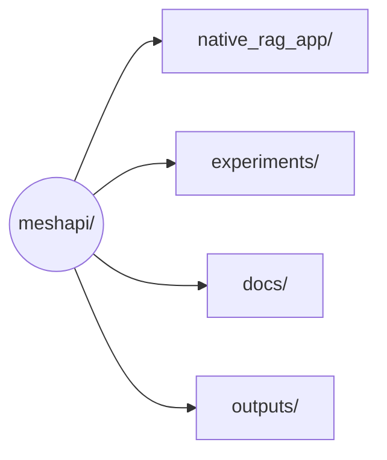
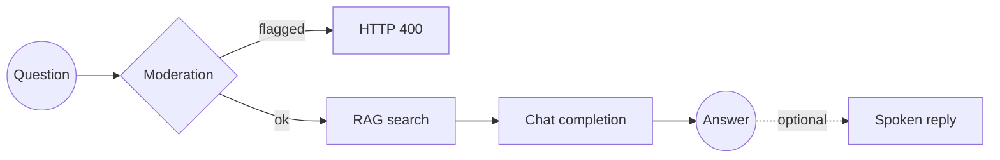

# MeshAPI tour

Hands-on walkthrough of [MeshAPI](https://developers.meshapi.ai): one `rsk_...` key, one OpenAI-shaped API, many providers behind it — plus embeddings, managed RAG, moderation, STT, and TTS.

Everything here was run against a live key.

## Layout

```
meshapi/
  native_rag_app/    Full RAG web app (MeshAPI only — the main thing to study)
  experiments/       Notebooks, in teaching order: 01 → 02 → features
  docs/              Written guides (start at docs/README.md)
  outputs/           Images, speech, and video from the notebooks
```



### `native_rag_app/`

A Harbor Desk support bot. Type or speak a question; MeshAPI stores, chunks, and searches the docs. No separate vector database. Optional spoken answers.

```
native_rag_app/
  config.py            env settings
  data.py              sample knowledge base
  meshapi_client.py    chat, RAG, moderation, STT, TTS
  rag.py               ingest / retrieve / answer
  schemas.py           request/response models
  main.py              FastAPI routes
  templates/index.html
  static/app.js
  static/style.css
```

### `experiments/`

| Notebook | What it covers |
|---|---|
| `01-meshapi-basics.ipynb` | Open a client, list models, one chat call, print cost, close |
| `02-rag-multiagent.ipynb` | MeshAPI embeddings + Pinecone + Researcher / Writer / Critic |
| `features.ipynb` | Everything else, one feature at a time |
| `old-experiments/` | Earlier, denser versions of 01 and 02 |

### `docs/`

Read [`docs/README.md`](docs/README.md). Order: research → features walkthrough → CLI/MCP → the RAG app.

## How the RAG app uses MeshAPI



1. One `MeshAPI(base_url=..., token=...)` client.
2. Upload docs with `client.rag.upload_file(..., embed=True)` — MeshAPI chunks and embeds them.
3. Poll `embedding_status` until `ready`.
4. Search with `file_ids` scoped to this app's uploads (the store is account-wide; see below).
5. Moderate the question, then answer with `client.chat.completions.create`.
6. Optional STT / TTS on the same client.

**Gotcha:** `/v1/files` is account-wide and has no delete. `rag.py` writes our `file_id`s to `.rag_state.json` and always searches with those ids.

## Setup

Python 3.10+ and a MeshAPI key from the [dashboard](https://developers.meshapi.ai).

```bash
python -m venv meshapienv
source meshapienv/bin/activate
pip install -r requirements.txt
cp .env.example .env
```

Put your key in `.env`. Pinecone is only needed for `02-rag-multiagent.ipynb`. The web app does not use it.

## Run the RAG app

```bash
uvicorn native_rag_app.main:app --reload
```

Open http://127.0.0.1:8000, click **Index knowledge base** once, then ask a question (or use the mic).

```bash
curl -X POST http://127.0.0.1:8000/api/ingest
curl -X POST http://127.0.0.1:8000/api/ask \
  -H "Content-Type: application/json" \
  -d '{"question": "What happens if I invite more people than my plan allows?", "speak": true}'
```

## Next

- [`docs/README.md`](docs/README.md) — full doc index
- `experiments/` — live feature tour
- `native_rag_app/` — end-to-end app
