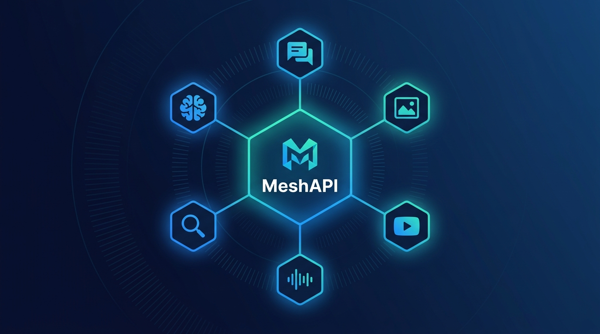
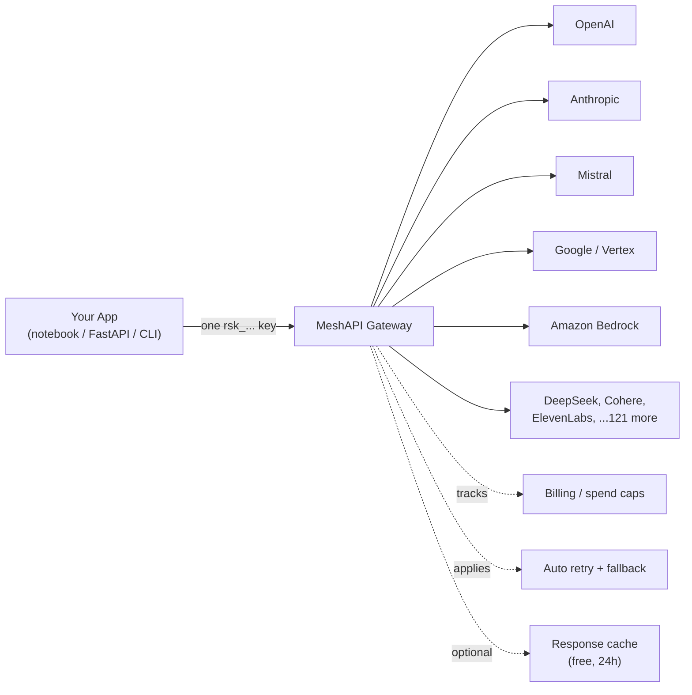
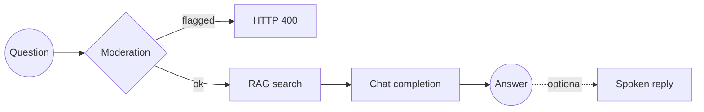

# MeshAPI — Universal AI Gateway Walkthrough

End-to-end exploration of [MeshAPI](https://developers.meshapi.ai), a unified AI model gateway that routes to **997+ models across 124+ providers** through a single API key and consistent OpenAI-shaped interface.

Everything here was executed against a live key with real outputs — not mocked or copied from docs.



## What is MeshAPI?

Think of it as a **universal power adapter** for AI models. One key, one API shape, hundreds of providers behind it:



## Project Layout

```
meshapi/
├── native_rag_app/    Harbor Desk — full RAG web app (MeshAPI only, no vector DB)
├── experiments/       Jupyter notebooks, in teaching order: 01 → 02 → features
├── docs/              Written research & guides
├── outputs/           Generated images, audio, and video from the notebooks
├── requirements.txt   All Python dependencies
└── .env.example       Environment variables template
```

## Features Covered

### Notebooks (`experiments/`)

| Notebook | What it covers |
|---|---|
| `01-meshapi-basics.ipynb` | Client setup, model listing, one chat call, cost check |
| `02-rag-multiagent.ipynb` | MeshAPI embeddings + Pinecone + multi-agent (Researcher / Writer / Critic) |
| `features.ipynb` | **30+ features**, one at a time — the comprehensive feature tour |

`features.ipynb` walks through every MeshAPI capability:

| Category | Features |
|---|---|
| **Talking to models** | Chat completions, streaming, tool/function calling, structured outputs, compare (multi-model), model discovery, error handling, Responses API, Auto Router |
| **Retrieval & memory** | Embeddings (44 models, 12 brands), built-in RAG (file upload + search), Memory/guardrails |
| **Media generation** | Image generation, image editing (background removal, upscale, inpaint), video generation, text-to-speech, speech-to-text, audio translation, realtime speech-to-speech |
| **Safety** | Moderations (13 categories with confidence scores) |
| **Reliability & cost** | Automatic retry/fallback, response caching, Batch API |
| **Prompts & workflow** | Prompt templates (server-side `{{variables}}`), web search |
| **Accounts & ops** | Balance, usage/rate-limits, API key management, organizations |
| **Developer tooling** | Python SDK, Go SDK, MCP Server, CLI |

### Harbor Desk — RAG Web App (`native_rag_app/`)

A support bot built entirely on MeshAPI's managed services. No separate vector database.



**How it works:**
1. Upload docs → MeshAPI chunks, embeds, and stores them automatically
2. Every question is moderated before it reaches the model
3. RAG search retrieves relevant chunks, chat completion generates the answer
4. Optional STT input (speak your question) and TTS output (hear the answer)

### MCP Server

Confirmed live with Claude Code. The MeshAPI MCP server exposes 22 tools:

| Category | Tools |
|---|---|
| **Inference** | `chat`, `responses`, `compare`, `embeddings`, `moderations`, `router_select` |
| **Media** | `generate_image`, `edit_image`, `list_voices` |
| **Retrieval** | `web_search`, `file_search`, `upload_file`, `list_files`, `get_file` |
| **Templates** | `create_template`, `get_template`, `list_templates`, `update_template`, `delete_template` |
| **Account** | `list_models`, `get_balance` |

> **Gap:** `list_voices` is exposed but there's no TTS generation tool — speech synthesis requires the REST API directly.

### Generated Outputs (`outputs/`)

Sample outputs produced during the walkthrough:

| File | How it was made |
|---|---|
| `img/meshapi-is-best-whiteboard.jpg` | Image generation — `google/nano-banana-2` via MCP |
| `img/meshapi-linkedin-thumbnail.jpg` | Project thumbnail — `google/nano-banana-2` via MCP |
| `img/meshapi-tts-demo-card.png` | TTS demo card — `google/nano-banana-2` via MCP |
| `audio/meshapi-mcp-is-amazing.mp3` | Text-to-speech — `hexgrad/kokoro-82m`, voice `af_heart` |

## Quick Start

### Prerequisites

- Python 3.10+
- A MeshAPI key from the [dashboard](https://developers.meshapi.ai)

### Setup

```bash
git clone https://github.com/parthamehta123/meshapi.git
cd meshapi
python -m venv meshapienv
source meshapienv/bin/activate
pip install -r requirements.txt
cp .env.example .env
# Edit .env and add your MESH_API_KEY
```

### Run the notebooks

```bash
jupyter notebook experiments/
```

Start with `01-meshapi-basics.ipynb` → `02-rag-multiagent.ipynb` → `features.ipynb`.

> **Note:** `02-rag-multiagent.ipynb` also needs a `PINECONE_API_KEY`. The others only need `MESH_API_KEY`.

### Run the RAG app

```bash
uvicorn native_rag_app.main:app --reload
```

Open http://127.0.0.1:8000, click **Index knowledge base** once, then ask a question (or use the mic).

```bash
# Or via curl:
curl -X POST http://127.0.0.1:8000/api/ingest
curl -X POST http://127.0.0.1:8000/api/ask \
  -H "Content-Type: application/json" \
  -d '{"question": "What happens if I invite more people than my plan allows?", "speak": true}'
```

## Environment Variables

| Variable | Required | Used by |
|---|---|---|
| `MESH_API_KEY` | **Yes** | Everything |
| `MESHAPI_BASE_URL` | No (defaults to `https://api.meshapi.ai`) | Everything |
| `MESHAPI_CHAT_MODEL` | No (defaults to `openai/gpt-4o-mini`) | RAG app |
| `MESHAPI_TTS_MODEL` | No (defaults to `hexgrad/kokoro-82m`) | RAG app |
| `MESHAPI_TTS_VOICE` | No (defaults to `af_heart`) | RAG app |
| `MESHAPI_STT_MODEL` | No (defaults to `elevenlabs/scribe_v1`) | RAG app |
| `PINECONE_API_KEY` | Only for `02-rag-multiagent.ipynb` | Multi-agent notebook |

## Known Quirks & Gotchas

Discovered by running every feature live — see [`docs/01_research.md` §6.1](docs/01_research.md) for the full list:

- **SDK constructor:** `MeshAPI(token=..., base_url=...)` — it's `token`, not `api_key`, and `base_url` is required
- **TTS `response_format` bug:** passing any format (mp3, wav, pcm, opus) returns 422 across all models. Omit it entirely — the gateway returns `audio/mpeg`
- **Video generation balance reserve:** the gateway enforces a minimum balance threshold for async video jobs, even if your balance looks sufficient
- **MCP `generate_image` needs `model`:** the schema defaults it to null but the gateway rejects requests without it
- **Memory/API keys/Orgs need a JWT:** these endpoints reject `rsk_...` keys with `401 Token decode failed` — they need a dashboard login session token

## Documentation

Full docs in [`docs/`](docs/):

| Doc | What it covers |
|---|---|
| [`01_research.md`](docs/01_research.md) | Complete feature inventory with live verification results and SDK quirks |
| [`02_features.md`](docs/02_features.md) | Plain-English guide to every section of `features.ipynb` |
| [`03_cli_and_claude_code.md`](docs/03_cli_and_claude_code.md) | CLI and Claude Code integration |
| [`04_mcp_capabilities.md`](docs/04_mcp_capabilities.md) | MCP Server capabilities |
| [`05_meshapi_vs_claude_code.md`](docs/05_meshapi_vs_claude_code.md) | MeshAPI vs Claude Code comparison |
| [`06_native_rag_app.md`](docs/06_native_rag_app.md) | Harbor Desk RAG app architecture and usage |

## Tech Stack

- **Gateway:** [MeshAPI](https://developers.meshapi.ai) (`meshapi` Python SDK v0.1.11)
- **Frameworks:** FastAPI, Streamlit, LangChain
- **Vector DB:** Pinecone (only for multi-agent notebook; RAG app uses MeshAPI's managed store)
- **Language:** Python 3.12
