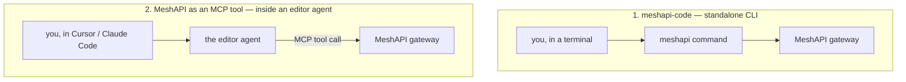

# `meshapi-code` and MeshAPI as an MCP tool

Two different things share “MeshAPI + coding tool.” This doc covers both.



- **`meshapi-code`** is MeshAPI’s own terminal coding agent. Install it, run `meshapi`, pick any gateway model.
- **MCP** is the other direction: Cursor or Claude Code calls MeshAPI as a tool in the same chat you already have.

They do not depend on each other.

---

## Part 1 — `meshapi-code`

### Install

`uv pip install meshapi-code` works, but the `meshapi` command only exists while that venv is active. For a CLI you want everywhere:

```bash
uv tool install meshapi-code
```

That exposes one command: **`meshapi`** (the package name is `meshapi-code`).

If `meshapi --version` is not found, the installer bin dir is not on `PATH`:

```bash
# this session only (zsh)
export PATH="$HOME/.local/bin:$PATH"

# permanent
uv tool update-shell
```

`uv tool update-shell` only applies to **new** terminals. Open a fresh window after running it. Invoke `meshapi` directly — not `uv meshapi`.

### First run

```bash
cd /path/to/meshapi
export MESH_API_KEY=rsk_your_key_here
meshapi
```

Then ask something like `explain what native_rag_app/rag.py does`. The `export` lasts for that shell only. Inside the session, `/login` saves the key to `~/.meshapi/credentials` (mode `0600`).

### How the CLI finds a key

First match wins: `MESHAPI_API_KEY` → `MESH_API_KEY` → `~/.meshapi/credentials`.

It does **not** load this repo’s `.env`. Export the key, or use `/login`. Non-HTTPS `base_url` values are rejected except `localhost`.

### Commands (from `/help`)

```
/exit                      end session
/clear                     reset conversation
/model <name>              switch model (e.g. anthropic/claude-sonnet-4.5)
/models [free|<query>]     browse the catalog (context, $/1M pricing)
/route auto|off|preview    auto-route each prompt to the best model
/fallback <m1> <m2> | off  ordered fallback models if the primary fails
/reasoning <level>         high|medium|low|none|off reasoning effort
/mode <perm>               default|accept-edits|auto|bypass  (or shift+tab)
/file <path>               add text file to context
/image <path|url>          attach an image (base64) to the next prompt
/clear-attach              drop any queued image attachments
/system <txt>              set system prompt
/cost                      show session spend
/optimize <dial>           token savings, beta: 0 off, up to 0.95
/memory [notes|clear|on|off]  repo memory: map + notes from past sessions
/login                     set or replace your API key
/update                    check PyPI for a newer meshapi
/help                      show this
```

Launch flags:

```bash
meshapi --model openai/gpt-4o-mini --route auto --mode accept-edits
```

### Models and permission modes

Switch mid-session with `/model openai/gpt-4o-mini`, browse with `/models` / `/models free`, or pass `--model` at launch. `/route auto` lets the gateway pick per prompt.

| Mode | Behavior |
|---|---|
| `default` | Asks before file writes, commands, or search |
| `accept-edits` | File writes auto-approved; commands still ask |
| `auto` | Writes, commands, and web search without asking |
| `bypass` | Almost everything auto-approved |

Use this CLI when you want a terminal agent on any MeshAPI model, without opening an IDE.

---

## Part 2 — MCP inside Cursor or Claude Code

MeshAPI’s MCP server is `https://api.meshapi.ai/mcp`. Add it once; the editor agent can call the gateway as tools.

### Claude Code CLI

```bash
claude mcp add --transport http mesh-api https://api.meshapi.ai/mcp \
  --header "Authorization: Bearer rsk_YOUR_KEY"
```

### Project file (Cursor / Claude Code extension)

Copy the template and put your real key in the ignored file:

```bash
cp .mcp.json.example .mcp.json
```

Reload the window. Tools such as `get_balance`, `generate_image`, and `chat` should show up.

```json
{
  "mcpServers": {
    "mesh-api": {
      "type": "http",
      "url": "https://api.meshapi.ai/mcp",
      "headers": { "Authorization": "Bearer rsk_YOUR_KEY" }
    }
  }
}
```

`.mcp.json` is gitignored. `.mcp.json.example` is the committed placeholder.

### Tools on MCP

```
chat, responses, embeddings, moderations, compare, router_select,
generate_image, edit_image, web_search, file_search, upload_file,
list_files, get_file, list_models, list_voices, get_balance,
list_templates, get_template, create_template, update_template, delete_template
```

Not on MCP: TTS/STT, video, batch, realtime audio. Those stay on the Python SDK (`features.ipynb`, `native_rag_app/`).

---

## Which to use

| You want to... | Use |
|---|---|
| Chat with any MeshAPI model from a terminal and edit files | `meshapi-code` |
| Ask Cursor/Claude Code for balance, models, or a quick MeshAPI call | MCP |
| Build a RAG app or notebook | The SDK — `native_rag_app/` and `experiments/` |

Both take the same `rsk_...` key. The CLI reads env / `/login`. MCP gets the key in the header, not from `.env`.
