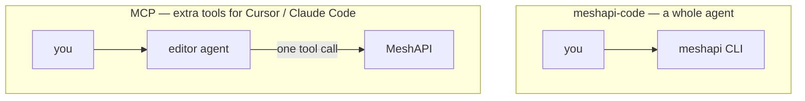
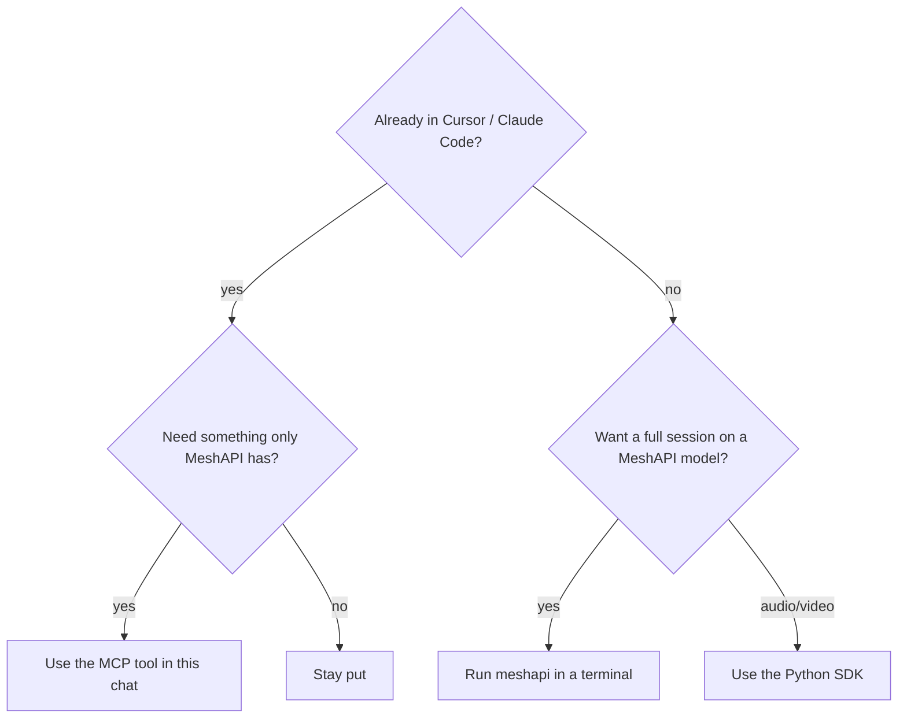

# meshapi-code vs MCP: what each can do

Same MeshAPI account, opposite shapes.

- **`meshapi-code`** is a full coding agent. You open it instead of Cursor/Claude Code.
- **MCP** does not replace the editor. The agent you already have can call MeshAPI for one job and keep going.

| | `meshapi-code` CLI | MCP |
|---|---|---|
| Chat | ✅ | ✅ `chat` |
| Read / edit project files | ✅ | ✅ (the editor already does this) |
| Run shell commands | ✅ | ✅ (the editor already does this) |
| Switch MeshAPI models | ✅ `/model` | ✅ per `chat` / `compare` call |
| Generate / edit an image | ❌ | ✅ |
| Search uploaded docs (RAG) | ❌ | ✅ `file_search`, `upload_file` |
| Check balance | ❌ | ✅ `get_balance` |
| TTS / STT | ❌ | ❌ |
| Video | ❌ | ❌ |

Audio and video are missing from both. Use the Python SDK (`features.ipynb` or a small script).

## Confirmed missing from MCP

- Audio (TTS / STT)
- Video generation
- Batch API
- Realtime voice

Working fallback: `client.audio.synthesize(...)`, `client.videos.generate(...)`.

## What MCP does cover

**Text** — `chat`, `compare`, `responses`, `router_select`

**Images** — `generate_image`, `edit_image` (image comes back as inline base64, even if you ask for a URL)

**Docs** — `upload_file`, `list_files`, `get_file`, `file_search`

**Other** — `embeddings`, `moderations`, `list_models`, `list_voices`, template CRUD, `get_balance`

Quirk: the bytes MeshAPI returns for audio may not match the filename suffix. Check the header (`RIFF` = WAV, `ID3` = MP3) before trusting `.mp3` / `.wav`.

See [`03_cli_and_claude_code.md`](03_cli_and_claude_code.md) for setup and [`01_research.md`](01_research.md) for the full feature list.
