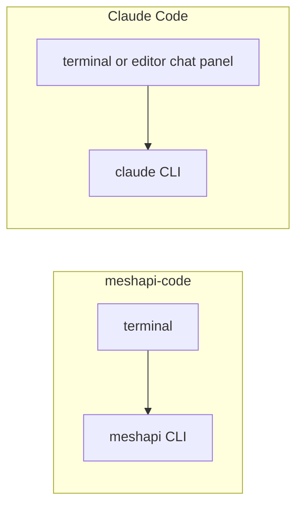
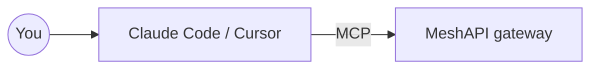

# `meshapi-code` vs Claude Code as products

[`04_mcp_capabilities.md`](04_mcp_capabilities.md) compares tools. This page is about how the two products are built.

Claude Code is a terminal/CLI agent that also ships as an editor extension (VS Code, Cursor, JetBrains). It is not a separate desktop app with its own file tree.

Both read and edit files, run commands, ask before risky work, and chat about code.

| | `meshapi-code` | Claude Code |
|---|---|---|
| Built by | MeshAPI | Anthropic |
| Models | Anything MeshAPI routes — `/model` to swap | Claude, via Anthropic |
| Where it runs | Terminal | Terminal, or an editor extension |
| Extra tools via MCP | No | Yes (including this repo’s `mesh-api` server) |
| Billing | MeshAPI prepaid balance | Anthropic subscription or API |

The editor can call MeshAPI as a tool. `meshapi-code` cannot call back into Claude Code.

**Rule of thumb:** already in Cursor or Claude Code and need one MeshAPI action → MCP. Want a separate session on a non-Claude model → `meshapi` in a terminal. Audio and video: SDK only — see [`04_mcp_capabilities.md`](04_mcp_capabilities.md).
