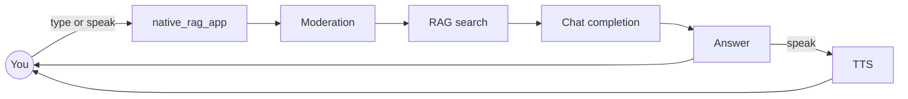

# `native_rag_app` — MeshAPI RAG with voice

Support bot for a fictional product (Harbor Desk). Type or speak a question; it searches MeshAPI’s file store and can speak the answer back. There is no local vector database.



## What MeshAPI hides

Chunk size, embedding model, and the backing vector store are not documented. You see `embedding_status`, `chunk_index`, and token/cost fields after upload. A ~1,500-character doc came back as one chunk in testing, so the split threshold is larger than that.

If you need to pick chunking or the embedding model yourself, that is the `02-rag-multiagent.ipynb` path (Pinecone). This app trades that control for less code.

## Folder

| File | Role |
|---|---|
| `config.py` | Env settings — only `MESH_API_KEY` is required |
| `data.py` | Eight short policy documents |
| `meshapi_client.py` | Chat, RAG, moderation, STT, TTS |
| `rag.py` | Ingest, search, answer prompt |
| `main.py` | FastAPI page + JSON API |
| `templates/index.html` | UI |
| `static/app.js` | Type, mic, playback |
| `static/style.css` | Layout |

## Env

One key: `MESH_API_KEY`. Optional overrides for chat model, `RAG_TOP_K`, TTS, and STT live in `.env.example`.

## Run

```bash
source meshapienv/bin/activate
pip install -r requirements.txt
uvicorn native_rag_app.main:app --reload
```

Open http://127.0.0.1:8000, click **Index knowledge base**, then ask.

```bash
curl -X POST http://127.0.0.1:8000/api/ingest
curl -X POST http://127.0.0.1:8000/api/ask \
  -H "Content-Type: application/json" \
  -d '{"question": "What happens if I invite more people than my plan allows?", "speak": true}'
```

| Endpoint | What it does |
|---|---|
| `POST /api/ingest` | Upload the eight docs and wait for embedding |
| `POST /api/ask` | Text in → answer + sources. `"speak": true` adds audio |
| `POST /api/ask-voice` | Audio in → transcribe, answer, always speak back |

Every question is moderated before search or chat. An unsafe prompt returns HTTP 400 and does not hit the model.

## Account-wide store

Uploads on this key stay searchable forever; there is no delete. `ingest()` writes file ids to `.rag_state.json` (gitignored). Every search passes those ids so leftover files from `features.ipynb` or older runs do not appear in results.
